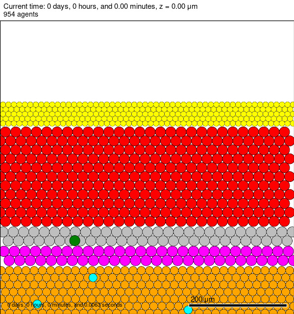
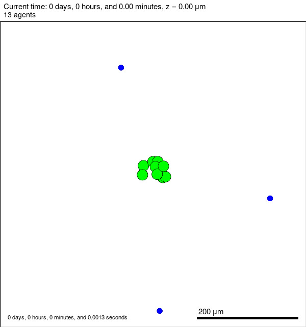
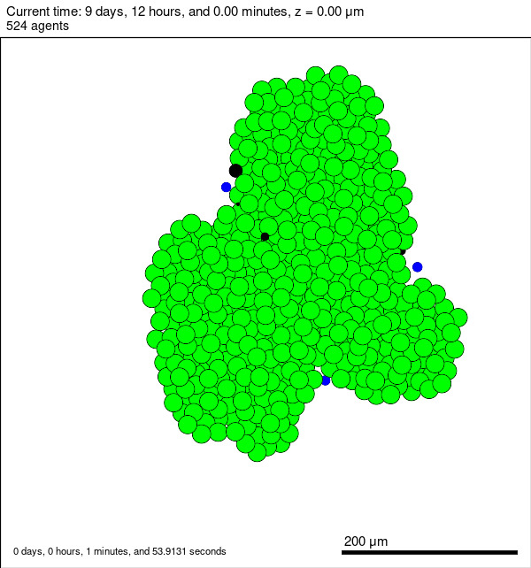
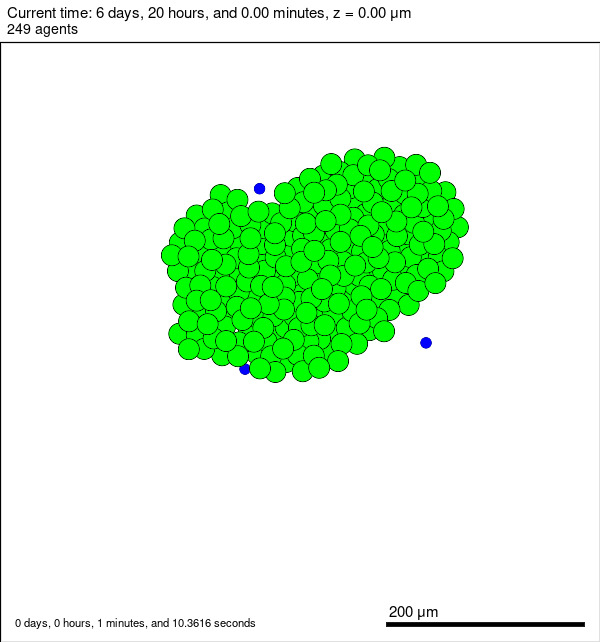

# Modélisation multi‑échelle de la dynamique des cancers de la bouche et de leurs interactions avec le micro‑environnement buccal

**Sommaire :**

1. [Description de l’analyse de sensibilité](#1-description-de-lanalyse-de-sensibilité)

   1.1 [Descente de la tumeur dans le tissu conjonctif](#11-descente-de-la-tumeur-dans-le-tissu-conjonctif)  
   1.2 [Persistance de la tumeur dans le tissu conjonctif](#12-persistance-de-la-tumeur-dans-le-tissu-conjonctif)

2. [Description du repo GitHub](#2-description-du-repo-github)

   2.1 [Structure du repo GitHub](#22-structure-du-repo-github)

   2.2 [Lancer une analyse de sensibilité](#21-lancer-une-analyse-de-sensibilité)

3. [Résultats](#3-résultats)

   3.1 [Descente de la tumeur dans le tissu conjonctif](#31-descente-de-la-tumeur-dans-le-tissu-conjonctif)

   3.1.1 [Analyse de sensibilité n°1 à 4 paramètres](#311-analyse-de-sensibilité-n1-à-4-paramètres)

   3.1.2 [Analyse de sensibilité n°2 à 3 paramètres](#312-analyse-de-sensibilité-n2-à-3-paramètres)

   3.1.3 [Analyse de sensibilité n°3 à 3 paramètres](#312-analyse-de-sensibilité-n3-à-3-paramètres)

   3.2 [Persistance de la tumeur dans le tissu conjonctif](#32-persistance-de-la-tumeur-dans-le-tissu-conjonctif)

   3.2.1 [Analyse de sensibilité n°1 à 4 paramètres](#321-analyse-de-sensibilité-n1-à-4-paramètres)

   3.2.2 [Analyse de sensibilité n°2 à 3 paramètres](#322-analyse-de-sensibilité-n2-à-3-paramètres)

4. [Reproductibilité](#3-reproductibilité)

5. [Bibliographie](#5-bibliographie)

## 1. Description de l’analyse de sensibilité

_Liste des agents dans le modèle_

Un modèle agent a été implémenté sur PhysiCell avec un agent par type de tissu ou de cellules de la bouche :

- Cellules de l’épithélium basal `epi_basal`
- Cellules de l’épithélium intermédiaire `epi_inter`
- Cellules de l’épithélium supérieur `epi_sup`
- Cellules cancéreuses `cancer`
- Cellules cancéreuses mésenchymateuses (perte d’adhésion avec les autres agents) `cancer_mes`
- Cellules T `TCell`
- CAF – Cancer Associated Fibroblast `CAF`
- Membrane basale `membrane`

_Analyse de sensibilité globale - Méthode de Sobol_

Deux analyses de sensibilité globale ont été réalisées à l’aide de la méthode de Sobol implémentée dans le package Python SALib : [SALib](https://salib.readthedocs.io/en/latest/api.html). L’objectif de ces analyses était d’identifier les facteurs du micro‑environnement tumoral qui favorisent la pénétration et persistance d’une tumeur et de déterminer quels paramètres ont le plus d’impact sur celle-ci. Une tumeur est considérée persistante lorsqu’elle descend dans le tissu conjonctif et échappe au phénomène de tapis roulant de l’épithélium.

Nous avons privilégié une analyse de sensibilité globale plutôt qu'une méthode de screening ou une analyse de sensibilité locale, car l'objectif est d'étudier le comportement du modèle dans son ensemble plutôt que d'une solution particulière [3]. Nous avons opté pour la méthode de Sobol, basée sur la décomposition de la variance, qui permet d'estimer les indices de sensibilité associés à chaque paramètre. Cette analyse fournit des indices de sensibilité qui quantifient l’impact relatif de chaque paramètre d’entrée sur les résultats du modèle. La méthode de Sobol, implémentée dans SALib [2], renvoie trois indices de sensibilité permettant d'analyser l'influence des variables d'entrée sur la variance de sortie, en distinguant leur effet propre (S1), l'effet de leurs interactions deux à deux (S2) et leur impact total, interactions comprises (ST).Chaque indice est associé à un intervalle de confiance de 95 %.

_Etapes pour réaliser une analyse de sensibilité_

Les différentes étapes pour réaliser ces deux analyses de sensibilité sont :

1. Définir les paramètres à étudier qui semble avoir un impact sur la descente de la tumeur dans le tissu conjonctif et sa persistance.
2. Définir les intervalles de ces paramètres et échantilloner dans l'espace de paramètre à l'aide du sampler Sobol implémenté dans SALib.
3. Pour ces $n$ jeux de paramètres, lancer $n$ simulations à l'aide du modèle agent implémenté avec PhysiCell.
4. Sur chaque sortie $n$ du modèle, calculer une métrique adéquate (temps de descente dans le tissu conjonctif ou volume de tumeur au cours du temps).
5. Réaliser l'analyse de sensibilité de Sobol avec la méthode implémentée dans SALib et interprétation des indices de Sobol.

Les deux premières analyses de sensibilité et les premiers paramètres choisis pour la pénétration et la persistance de la tumeur sont décrits dans les parties 1.1 et 1.2. D'autres analyses ont ensuite été réalisées avec quelques modifications ; elles sont décrites dans la partie « Résultats ».

### 1.1 Descente de la tumeur dans le tissu conjonctif

La première analyse avait pour objectif d’évaluer la descente de la tumeur dans le tissu conjonctif.  
Les fichiers d’initialisation de PhysiCell sont disponibles dans le dossier `projet_PhysiCell/`.

Dans les conditions d’initialisation, une seule cellule cancéreuse (non mésenchymateuse) est présente. Elle ne peut ni se diviser, ni mourir.  
Le ratio du temps de descente de cette cellule dans le tissu conjonctif sur le temps total de simulation est calculé comme le ratio du temps de descente dans le tissu conjonctif sur le temps total de simulation :

$$
\text{descent time} = \frac{t_{\text{descent in conj}}}{t_{\text{tot}}}
$$

- Si le ratio est égal à 1, la cellule a été éjectée par le tapis roulant ou n’a jamais traversé la lame basale.
- Si le ratio est égal à 0, la cellule est passée dans le tissu conjonctif dès le premier pas de temps.

Cette métrique permet d’évaluer la facilité avec laquelle la cellule cancéreuse s’infiltre dans le tissu conjonctif. Une cellule cancéreuse est supposée infiltrée dans le tissu conjonctif si ces seuls voisins sont des agents du tissu conjonctif ou des CAFs.

Quatre paramètres ont été choisis pour cette analyse de sensibilité :

#### • Vitesse de migration des agents `cancer` et `cancer_mes` $(s_{mot}$)

Cette vitesse fait partie des paramètres définissant la motilité d’un agent.  
Le biais de migration $d_{bias}$ a été fixé à 0.5, ce qui confère à l’agent une motilité **semi‑déterministe** en réponse à un stimulus chimique, ici le `CAF_chemotaxis` qui attire les cellules cancéreuses.

Modifier la vitesse de migration influence donc la rapidité avec laquelle l’agent répond à la chimio‑attraction (Ghaffarizadeh et al., 2018)[1].

La plage de variation choisie est 0.01 à 1 µm/min (valeur par défaut).  
À $s_{mot} = 1$, l’agent traverse la membrane très rapidement, alors qu’à ($s_{mot} = 0.01$), il le fait beaucoup plus rarement.

#### • Taux d’attachement des agents de la `membrane` entre eux

La membrane basale est une matrice extracellulaire spécialisée, constituée de macromolécules qui s’assemblent et s’attachent entre elles, assurant le soutien de l’épithélium vis-à-vis du tissu conjonctif. On a donc supposé que les agents de la membrane basale étaient attachés entre eux. Le taux d'attachement des agents de la membrane entre eux a été fixé arbitrairement entre 0 (pas attachés) et 10 (très attachés) $\mathrm{min}^{-1}$.

#### • Transition entre `cancer` et `cancer_mes` (et inversement)

Les cellules cancéreuses ont une certaine probabilité par minute de devenir mésenchymateuses (ou inversement de redevenir adhérentes). Cette probabilité a été fixée entre 0.00001 et 0.001 $\mathrm{min}^{-1}$. Au‑delà de 0.001, l’agent changeait trop souvent de type (environ toutes les heures).

#### • Sécrétion de métalloprotéinases (MMP) par les cellules cancéreuses

Les cellules cancéreuses vont sécréter des métalloprotéinases qui vont dégrader la membrane basale. Cela a été implémenté sous forme d'un facteur MMP sécrété par les cellules cancéreuses. Ce facteur augmente la probabilité de dégradation des agents de la membrane au contact. Ce paramètre a été fixé arbitrairement entre 0 (aucune sécrétion) et 50 (sécrétion importante) $\mathrm{min}^{-1}$.

### 1.2 Persistance de la tumeur dans le tissu conjonctif

La deuxième analyse de sensibilité visait à évaluer la persistance de la tumeur dans le tissu conjonctif en fonction du micro‑environnement présent.

Une fois la cellule cancéreuse mésenchymateuse entrée dans le tissu conjonctif, il a été supposé que la tumeur n’interagissait pas ou peu avec la matrice extracellulaire (tissu conjonctif) ou les CAF. C'est pourquoi dans les conditions initiales, seules 10 cellules tumorales et 3 cellules T ont été ajoutées. Il a été supposé que seuls ces deux types cellulaires, ainsi que certains paramètres les concernant, influencent la persistance tumorale au cours du temps. Il faut garder à l’esprit que les résultats sont très fortement dépendants de ces conditions initiales.

La métrique choisie est l'intégrale du volume de la tumeur au cours du temps :

$$
\text{volume over time} = \int_0^T \text{volume des cellules tumorales}(t)\ dt
$$

Plus cette métrique est grande, plus la tumeur a été importante dans la simulation.

Quatre paramètres ont également été identifiés pour cette analyse :

#### • Vitesse de migration des `TCell`

Les cellules cancéreuses mésenchymateuses émettent un `cancer_factor` qui attire les cellules T. Comme expliqué dans la partie 1.1, modifier la vitesse de migration influence la force d’attraction vers le stimulus chimique, la sensibilité au chimiotactisme ayant été fixée. Il a par ailleurs été observé que modifier la vitesse de migration $s_{mot}$ avait un impact plus important que modifier la sensibilité au chimiotactisme. La vitesse a été fixée entre 0.01 et 1 µm/min.

#### • Division des cellules cancéreuses mésenchymateuses

Les cellules cancéreuses vont se diviser de manière déterministe après un certain temps suivant leur naissance. Ce temps a été fixé entre 1 et 3 jours, ce qui est cohérent avec la durée moyenne d'un cycle cellulaire pour des cellules cancéreuses. Par ailleurs, mettre des valeurs plus élevées ne serait pas pertinent car les cellules cancéreuses à l'état initiale seraient sinon dégradées trop vite par les cellules T. Au contraire, mettre des valeurs plus basses entrainerait inévitablement une division anarchique et incontrolée des cellules cancéreuses.

#### • Mort des cellules cancéreuses

A chaque pas de temps, chaque cellule cancéreuse à une probabilité de mourir par apoptose (sans intervention des cellules T), proportionnelle au taux de mort fixé dans le modèle. Plus cette valeur est élevée, plus la probabilité de mort cellulaire est importante, ce qui conduit à une diminution plus rapide de la population de cellules cancéreuses. Nous avons pris un intervalle de valeurs compris entre $\mathrm{10}^{-6}$ et $\mathrm{10}^{-5}$ $\mathrm{min}^{-1}$, ce qui correspond à des cellules cancéreuses résistantes à l'apoptose dans le temps.

#### • Taux de d'attaque des cellules T aux cellules cancéreuses

Lorsqu’une cellule T est en contact avec une cellule cancéreuse, elle inflige des dommages à cette dernière, proportionnels au taux d’attaque fixé dans le modèle. Plus cette valeur est élevée, plus les cellules T endommagent rapidement les cellules cancéreuses, augmentant ainsi leur probabilité d’entrer en apoptose et conduisant à une élimination plus efficace de la tumeur. Nous avons pris un intervalle de valeurs compris entre 0.2 et 2 $\mathrm{min}^{-1}$, ce qui permet de représenter différents niveaux d’efficacité des cellules T sur les cellules tumorales.

## 2. Description du repo GitHub

En fonction de votre système d’exploitation (Windows ou Unix), une modification dans le script `test_analyse_sensibilite.py` doit être réalisée.  
Dans la fonction `get_physicell_output`, il faut adapter la commande exécutée dans `process1` :

```python
# Run .exe file
process1 = subprocess.run(
    [os.path.join(root_path, "PhysiCell/project.exe")],  # Ajouter .exe sous Windows et l’enlever sous Unix ("PhysiCell/project")
    capture_output=True,
    text=True,
    cwd=os.path.join(root_path, "PhysiCell")
)
```

## 2.1 Structure du repo GitHub

- **`parameters/`**  
  Contient les fichiers `.json` avec le détail des paramètres.

Un exemple de fichier `.json`:

```json
{
  "analyse_sensibilite": "descent_time",
  "_comment": "intervalles de paramètres correspondant dans l'ordre à 'attachment_rate', 'cancer_motility_speed', 'transformation_rate_mes', 'sensitivity_mmp_factor'",
  "param_bounds": [
    [0, 10],
    [0.01, 0.5],
    [0, 1],
    [0, 10]
  ],
  "seed": 19,
  "nb_threads": 1,
  "xml_path": "Path/to/XML/file.xml",
  "physicell_path": "Path/to/PhysiCell/",
  "results_path": "Path/to/result/folder",
  "nb_sample_to_generate": 4
}
```

Ce fichier permet de définir les intervalles de chaque paramètre ainsi que les chemins vers les dossiers nécessaires à l’analyse de sensibilité (PhysiCell, résultats).  
Le nombre de cœurs peut être modifié via `nb_threads` (Note : il a été observé que fixer `nb_threads = 1` améliore la reproductibilité), ainsi que la seed de PhysiCell (fixée arbitrairement à 19).  
Dans la méthode de Sobol implémentée dans SALib [2], le nombre de jeux de paramètres générés est :

$$
N \times (2 + 2D)
$$

avec $D = 4$ (quatre paramètres à explorer dans l'analyse) et $N$ choisi par l’utilisateur (doit être un multiple de 2) [2].  
Compte tenu des temps de simulation, il n’a pas été possible de choisir au‑dessus de $N = 4$ ou $N = 8$ (ce qui augmente les intervalles de confiance sur les indices de sensibilité estimés).

- **`scripts/`**
  - `test_analyse_sensibilite.py`  
    Réalise l’échantillonnage des paramètres avec SALib, lance les simulations PhysiCell et calcule l’analyse de sensibilité globale.
  - `functions.py`  
    Implémente la lecture du fichier XML et le calcul des métriques pour la descente de la tumeur et la persistance.
  - `test_functions.py`  
    Contient quelques tests unitaires écrits avec `pytest`, utilisant des fichiers du dossier `test/`.
  - `interface.py`  
    Interface graphique Tkinter permettant de modifier les paramètres et chemins directement via l’interface, puis de lancer l’analyse de sensibilité (appel à `run_main_analysis()` dans `test_analyse_sensibilite.py`). L'interface graphique peut être lancé après avoir activé l'environnement virtuel et lancé cette commande : `python interface.py`.
  - `comparaison_fichier.py`
    Ce script a servi à comparer les fichiers de sortie de l'analyse de sensibilité à 4 paramètres de la descente de la tumeur dans le tissu conjonctif pour vérifier la reproductibilité. Les simulations ont été lancées deux fois (deux fois 40 simulations avec 40 jeux de paramètres différents) et les fichiers output `*_cells.mat` et `*_cell_neighbor_graph.txt` comparés. Ces deux analyses ont donné exactement les mêmes résultats confirmant la reproductibilité de nos simulations quand le nombre de coeur pour la simulation est défini à 1.
  - `make_video.py`
    Ce script permet de générer toutes les vidéos pour une analyse de sensibilité donnée. Les chemins sont à modifier dans le fichier python.

- **`projet_PhysiCell/`**
  Enfin, les fichiers C++ et les fichiers d’initialisation pour toutes les analyses de sensibilité réalisées sont présents dans `projet_PhysiCell`. Chaque analyse a son dossier de configuration `config_descent_time1` avec les fichiers d'initilisation à l'intérieur (`cells.csv`, `cell_rules.csv` et `PhysiCell_settings.xml`).

## 2.2 Lancer une analyse de sensibilité

Étapes :

1. Choisir l'analyse à réaliser, copier la configuration adéquate dans un dossier `config` à l'intérieur du dossier `projet_PhysiCell`
2. Copier le projet `projet_PhysiCell` dans `user_projects` dans le dépôt `PhysiCell`
3. Charger le projet dans PhysiCell : `make load PROJ=projet_PhysiCell`
4. Créer l’environnement virtuel :  
   `python -m venv AS_env` puis l’activer
5. Installer les dépendances :  
   `python -m pip install -r requirements.txt`
6. Modifier les chemins et les intervalles de paramètres dans le fichier `fichier_param.json`
7. Lancer l’analyse de sensibilité :  
   `python test_analyse_sensibilite.py "chemin/vers/fichier_param.json"`  
   (après avoir activé l’environnement virtuel)

Quatre types d’analyses peuvent être lancés avec la modification des quatre paramètres décrits en section 1 : `descent_time1`, `descent_time2`, `tumor_persistance1` ou `tumor_persistance2`. Les premières analyses de sensibilité ont été réalisées à 4 paramètres et les deuxièmes à 3 paramètres suivant les résultats obtenus lors des premières analyses.

## 3. Résultats

### 3.1 Descente de la tumeur dans le tissu conjonctif

#### 3.1.1 Analyse de sensibilité n°1 à 4 paramètres

Les simulations pour cette analyse de sensibilité ont une durée totale de 30 000 minutes soit ~21 jours.

Les paramètres utilisés pour cette analyse de sensibilité sont présents dans le fichier « parameters_descent_time1.json ». Quarante jeux de paramètres ont été générés avec cette analyse de sensibilité. Sur ces 40 jeux de paramètres, la métrique de sortie était différente de 1 uniquement pour les simulations 12, 21 et 26. Cela signifie que la cellule cancéreuse ne s’est quasiment jamais infiltrée dans le tissu conjonctif. L’analyse de Sobol n’a donc pas pu déterminer l’influence des paramètres sur le ratio de temps, car tous les résultats étaient identiques. Les indices de premier, de second ordre et d’ordre total sont donc tous égaux à 0 (de même que leur intervalle de confiance).



**_*Figure 1  — Conditions initiales - descente de la tumeur dans le tissu conjonctif*_**

La gestion de l’adhésion des cellules cancéreuses non mésenchymateuses aux autres agents a été mal mise en œuvre. Les cellules cancéreuses non mésenchymateuses adhèrent trop fortement aux agents de la membrane et ne s'infiltrent donc jamais. En effet, même dans la simulation 21, où la cellule cancéreuse est infiltrée (cf. Frame 197).


**_*Figure 2 — Frame 197 de la simulation 21 - descente de la tumeur dans le tissu conjonctif*_**

Cette cellule a une certaine probabilité de redevenir adhérente (non mésenchymateuse). Une fois redevenue non mésenchymateuse, elle adhère automatiquement aux agents de la membrane (cf. image 215). En effet, même si la cellule cancéreuse adhère autant aux agents de la membrane qu’aux agents du tissu conjonctif. Ces derniers n’adhèrent à rien. Par ailleurs, la probabilité de passer d'une cellule cancéreuse non mésenchymateuse à une cellule mésenchymateuse par minute est trop élevée. Par exemple, dans la simulation 21, cette probabilité par minute était de ~9e-7 entre chaque frame séparée de 2 heures, la cellule changeait de type.


**_*Figure 3  — Frame 215 de la simulation 21 - descente de la tumeur dans le tissu conjonctif*_**

Une future analyse de sensibilité prenant en compte les adhésions entre les différents agents devrait être réalisée. Ils n’avaient pas été pris en compte dans cette analyse car cela aurait impliqué un trop grand nombre de paramètres. Pour des raisons de temps, et parce que nous voulions prioriser l’étude de la descente de la tumeur dans le tissu conjonctif, nous n'avons pas pu la réaliser. La transition réversible entre cellule cancéreuse mésenchymateuse ou non a été supprimée dans la deuxième analyse (cf partie 3.1.2). Les conditions initiales seront les mêmes (cf. frame 0), mais la cellule cancéreuse sera déjà mésenchymateuse. Par ailleurs, le temps de simulation total de cette deuxième analyse sera de 10 000 minutes, soit environ 7 jours, en raison du temps de simulation.

#### 3.1.2 Analyse de sensibilité n°2 à 3 paramètres

Les simulations pour cette analyse de sensibilité ont une durée totale de 10 000 minutes soit ~7 jours. Les paramètres utilisés pour cette analyse de sensibilité sont présents dans le fichier « parameters_descent_time2.json ». 64 jeux de paramètres ont été générés pour cette analyse de sensibilité. Une seule cellule cancéreuse mésenchymateuse est présente dans les conditions initiales.

**_Tableau 1 — Résultats ST et S1 pour l'analyse de sensibilité du temps de descente de la tumeur dans le tissu conjonctif_**

| Paramètre             | ST       | ST_conf | S1       | S1_conf |
| --------------------- | -------- | ------- | -------- | ------- |
| attachment_rate       | 0.372848 | NaN     | 0.038770 | NaN     |
| cancer_motility_speed | 0.674755 | NaN     | 0.084001 | NaN     |
| secretion_mmp_factor  | 0.000000 | NaN     | 0.000000 | NaN     |

**_Tableau 2 — Résultats S2 pour l'analyse de sensibilité du temps de descente de la tumeur dans le tissu conjonctif_**
| Interaction | S2 | S2_conf |
|--------------------------------------------------|-----------|---------|
| (attachment_rate, cancer_motility_speed) | 0.303832 | NaN |
| (attachment_rate, secretion_mmp_factor) | -0.135006 | NaN |
| (cancer_motility_speed, secretion_mmp_factor) | 0.103385 | NaN |

Le rapport entre le temps de descente et le temps de simulation totale est élevé, ce qui indique que la cellule cancéreuse n'a réussi à s'infiltrer que très rarement dans le tissu conjonctif. Cela explique pourquoi les intervalles de confiance à 95 % n'ont pas pu être calculés par SALib, car la variance de sortie est presque nulle. Par ailleurs, la sécrétion du facteur MMP n’a pas l’air d’avoir d’impact. Cette absence d'impact est confirmée par l'observation des simulations : la règle implémentée dans le fichier `cell_rules.csv` concernant la dégradation des agents de la membrane au contact du facteur MMP n'a pas d'effet. Le facteur de Hill de cette règle a été drastiquement diminué et la valeur de saturation augmentée. On obtient ainsi une cellule cancéreuse mésenchymateuse qui détruit les agents de la membrane grâce à la sécrétion du facteur MMP. Une troisième et dernière analyse de sensibilité a été réalisée (3.1.3) avec la même durée de simulation en prenant en compte ces nouveaux paramètres. L'intervalle de sécrétion du facteur MMP par les cellules cancéreuses a été modifié entre 0 (absence de sécrétion) et 10 (sécrétion importante entraînant la destruction des agents de la membrane). Le taux de décroissance du facteur a par ailleurs été diminué à 10.

#### 3.1.3 Analyse de sensibilité n°3 à 3 paramètres

_En cours de simulation_

### 3.2 Persistance de la tumeur dans le tissu conjonctif

#### 3.2.1 Analyse de sensibilité n°1 à 4 paramètres

Les simulations pour cette analyse de sensibilité ont une durée totale de 20 000 minutes soit ~14 jours. Les paramètres utilisés pour cette analyse de sensibilité sont présents dans le fichier « parameters_tumor_persistance1.json ». 40 jeux de paramètres ont été générés pour cette analyse de sensibilité. Les conditions initiales sont présentes dans la figure 4.



**_*Figure 4  — Conditions initiales - persistance de la tumeur dans le tissu conjonctif*_**

Cette analyse de sensibilité, qui visait à évaluer la persistance de la tumeur dans le tissu conjonctif, a révélé que la quasi-totalité des simulations montraient une destruction de la tumeur par les cellules T immunitaires en moins de 5 jours. Une seule simulation montrait une tumeur ayant dégénéré, il s'agit de la simulation 16, dont l'intégrale du volume de tumeur au cours du temps est de $1.21e-9$ (cf. image 114 de la simulation 16).



**_*Figure 5  — Frame 114 de la simulation 16 - persistance de la tumeur dans le tissu conjonctif*_**

**_Tableau 3 : Indices de sensibilité de Sobol : ST et S1 - persistance de la tumeur 1_**

| Paramètre                | ST            | ST_conf       | S1            | S1_conf      |
| ------------------------ | ------------- | ------------- | ------------- | ------------ |
| motility_speed_t_cell    | 108426.759242 | 121890.078353 | -13070.815269 | 14782.496551 |
| division_duration_cancer | 0.432986      | 0.923906      | -27.583017    | 58.606624    |
| death_cancer             | 0.000000      | 0.000000      | 0.000000      | 0.000000     |
| damage_attack_rate       | 1.246659      | 4.617532      | -30.066636    | 163.072035   |

**_Tableau 4 : Indices de sensibilité de Sobol : S2 - persistance de la tumeur 1_**
| Interaction | S2 | S2_conf |
|-------------------------------------------------------|---------------|----------------|
| (motility_speed_t_cell, division_duration_cancer) | 1.304825e+04 | 1.496764e+04 |
| (motility_speed_t_cell, death_cancer) | 1.304705e+04 | 1.496952e+04 |
| (motility_speed_t_cell, damage_attack_rate) | 1.304845e+04 | 1.496540e+04 |
| (division_duration_cancer, death_cancer) | -2.063099e+04 | 2.327319e+04 |
| (division_duration_cancer, damage_attack_rate) | -2.060431e+04 | 2.324288e+04 |
| (death_cancer, damage_attack_rate) | 6.750156e-14 | 2.454652e-13 |

Par ailleurs, les résultats de l'analyse de sensibilité globale ne sont pas interprétables (cf Tab. 3 et Tab. 4). En effet, les intervalles de confiance sont supérieurs aux indices de sensibilité. De plus, les indices de sensibilité de premier ordre sont négatifs, ce qui indique une erreur de calcul [2]. On remarque cependant que les indices de premier ordre et d'ordre total sont égaux à 0 pour le paramètre `death_rate`. On peut donc supposer que ce paramètre a peu d'impact sur la persistance de la tumeur dans le tissu conjonctif.
Une autre analyse a été réalisée (3.2.2) en augmentant le nombre de jeux de paramètres générés ($N = 8$, 64 jeux de paramètres générés) avec un paramètre en moins, afin d'obtenir des valeurs plus précises des indices de sensibilité (avec une durée de 10 000 minutes, soit environ 7 jours, pour des raisons de temps de simulation). Quarante jeux de paramètres avaient été générés à l'aide de l'échantillonneur Sobol implémenté dans SALib ($N = 4$ a été fourni comme paramètre) pour cette analyse.

#### 3.2.2 Analyse de sensibilité n°2 à 3 paramètres

Les simulations pour cette analyse de sensibilité ont une durée totale de 10 000 minutes soit ~7 jours. Les paramètres utilisés pour cette analyse de sensibilité sont présents dans le fichier « parameters_tumor_persistance2.json ». 64 jeux de paramètres ont été générés pour cette analyse de sensibilité.

**_Tableau 5 : Indices de sensibilité de Sobol : S1 et ST - persistance de la tumeur 2_**
| Paramètre | ST | ST_conf | S1 | S1_conf |
|---------------------------|-----------|---------|-----------|---------|
| motility_speed_t_cell | 0.932368 | 0.752895 | 0.200007 | 0.538610 |
| division_duration_cancer | 1.057549 | 1.032530 | 0.110790 | 1.845640 |
| damage_attack_rate | 0.069771 | 0.307917 | 0.012755 | 0.689408 |

**_Tableau 6 : Indices de sensibilité de Sobol : S2 - persistance de la tumeur 2_**
| Interaction | S2 | S2_conf |
|-------------------------------------------------------|------------|-----------|
| (motility_speed_t_cell, division_duration_cancer) | -0.181919 | 1.568371 |
| (motility_speed_t_cell, damage_attack_rate) | -0.128224 | 1.561183 |
| (division_duration_cancer, damage_attack_rate) | 1.016937 | 2.327555 |

La borne supérieure de l’intervalle de vitesse de migration des TCell a été modifiée pour passer à 0,5 à la suite de la première analyse de sensibilité.
Par ailleurs, un état de dégénérescence des cellules cancéreuses est rarement atteint, car le temps total de simulation est trop court. La tumeur n'a donc pas le temps de proliférer. La métrique est la plus grande à la frame 27 : ~ 5e7 (Fig. 6).



**_*Figure 6  — Frame 83 de la simulation 27 - persistance de la tumeur dans le tissu conjonctif*_**

Ces résultats sont plus cohérents que ceux de la partie 3.2.1, car ils ne présentent que des valeurs positives pour S1 et ST. Les valeurs négatives de S2 sont probablement dues à des erreurs de calcul et ne sont pas interprétables. L’intervalle de confiance de 95 % des indices de premier ordre, c'est-à-dire des effets propres de chaque paramètre, est supérieur à l’indice S1 ; on ne peut donc pas conclure à la présence ou non de l’effet propre de ces paramètres sur la persistance de la tumeur.
En revanche, les indices d'ordre total, qui prennent en compte les effets propres de chaque paramètre ainsi que les interactions d'ordre supérieur, ont des valeurs légèrement inférieures aux intervalles de confiance (ST ± ST\_(conf)).
On a :
ST(motility_speed_t_cell) : 0,932368 dans [0,179473 ; 1,685263] ; ST(division_duration_cancer) : 1,057549 dans [0,025019 ; 2,090079].

Nous pouvons donc conclure que la vitesse de migration des cellules T et la durée du cycle de division des cellules cancéreuses semblent avoir un impact sur la persistance de la tumeur. Il est cependant difficile de quantifier cet impact en raison des grands intervalles de confiance. La valeur du taux d'attaque des dommages ne semble pas avoir d'effet significatif (0 est inclus dans l'intervalle de confiance de 95 %).

Une autre analyse, avec une durée de simulation plus longue (20 000 minutes) et un plus grand nombre de jeux de paramètres générés, serait nécessaire pour améliorer la précision des indices de sensibilité.

## 4. Reproductibilité

## 5. Bibliographie

[1] Ghaffarizadeh, A., Heiland, R., Friedman, S. H., Mumenthaler, S. M., & Macklin, P. (2018). PhysiCell : An open source physics-based cell simulator for 3-D multicellular systems. PLoS Computational Biology, 14(2), e1005991. https://doi.org/10.1371/journal.pcbi.1005991

[2] Concise API Reference — SALib’s documentation. (s. d.). https://salib.readthedocs.io/en/latest/api.html

[3] Sobol, I. (2001). Global sensitivity indices for nonlinear mathematical models and their Monte Carlo estimates. Mathematics And Computers In Simulation, 55(1‑3), 271‑280. https://doi.org/10.1016/s0378-4754(00)00270-6
